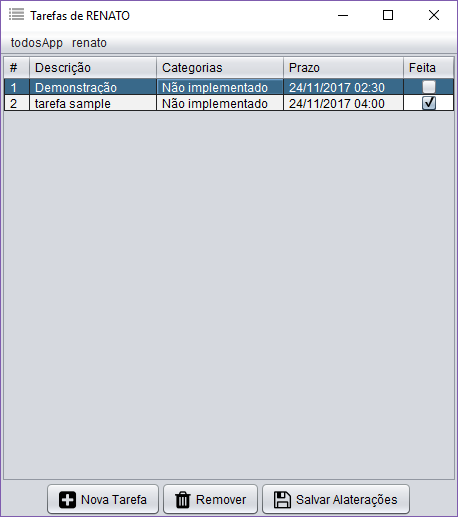
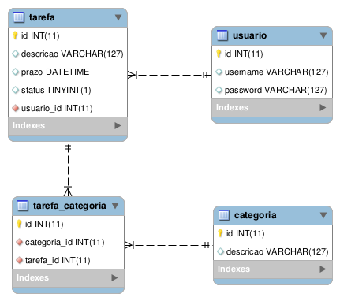

# Projeto Gerenciador de Tarefas

Este projeto é um **_fork_** de: [todos-app](http://trab.dc.unifil.br/gitlab/mhadaniya/todosapp)
do professor [Mario](https://github.com/mhadaniya), que visa
introduzir aos alunos diversos conceitos na área de programação como orientação
a objetos, _design patterns_, controle de versionamento, interação com base de
dados, gerenciador de pacotes e outros.

O projeto é um **gerenciador de tarefas**, onde cada tarefa possui
alguns atributos como descrição, prazo, categorias e cada tarefa possui um usuário.

Na imagem abaixo segue [minha](database/todosapp_1.0.0_script) versão do banco
de dados imprementado nessa aplicação, que foi feito baseado no
[modelo](http://trab.dc.unifil.br/gitlab/mhadaniya/todosapp/raw/master/img/bd.png)
utilizado no projeto do professor.

### Sobre meu "todosapp"

- Biblioteca utilizada para os icones da interface: [__jiconfont__](http://jiconfont.github.io/) 
- Biblioteca para seleção da data e hora no prazo das tarefas: [__LGoodDatePicker__](https://github.com/LGoodDatePicker/LGoodDatePicker)
